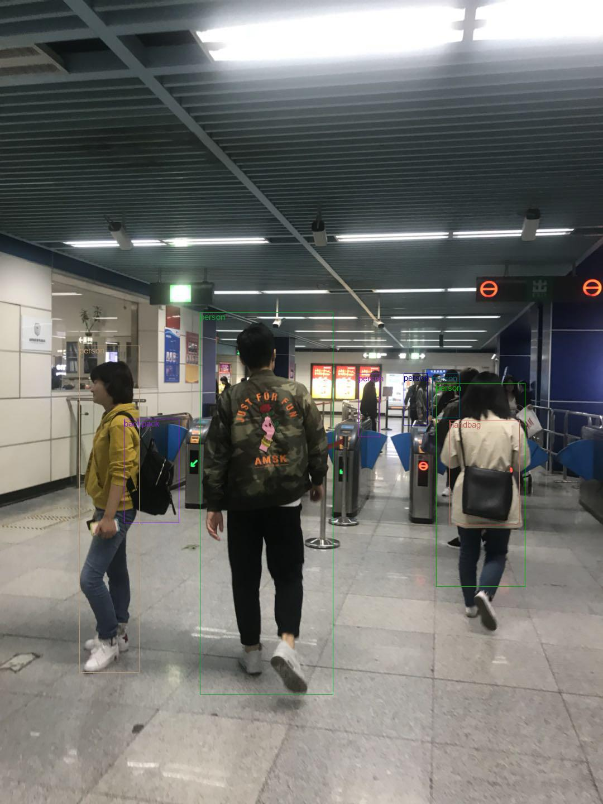

## Introduction
YOLO-v3 implemention from "[YOLOv3: An Incremental Improvement](https://pjreddie.com/media/files/papers/YOLOv3.pdf)". <br>
<p align="center"></p>

## Tutorial
Get tutorial series in [HomePage](https://ne7ermore.github.io/post/yolo-v3/)

## Requirement
```
pip install -r requirements.txt
```

## Usage

### Train
```
make

python3 train.py
```

### Detect
Download weight from [GoogleDrive](https://drive.google.com/file/d/1h3uo1lQoufEHPlGVHPF7_ZhqToTJkMvX/view?usp=sharing)
```
python3 detect.py
```

## Citation
If you find this code useful for your research, please cite:
```
@misc{TaoYOLOv3,
  author = {Ne7ermore Tao},
  title = {yolo-v3},
  publisher = {GitHub},
  year = {2018},
  howpublished = {\url{https://github.com/ne7ermore/yolo-v3}}
}
```
参考文献：https://arxiv.org/pdf/1612.08242.pdf
https://mp.weixin.qq.com/s?__biz=MzA3MzI4MjgzMw==&mid=2650741259&idx=1&sn=03dfb0fa3396e5464fc358b5a803e7bf&chksm=871ade75b06d5763a45f3c5da1ca62023a13c5cf7ce52a0a23e6c320f129f79bb9b3be4d2da0&scene=21#wechat_redirect
## Contact
Feel free to contact me if there is any question (Tao liaoyuanhuo1987@gmail.com).
（TJMtaotao）2949465671@qq.com
